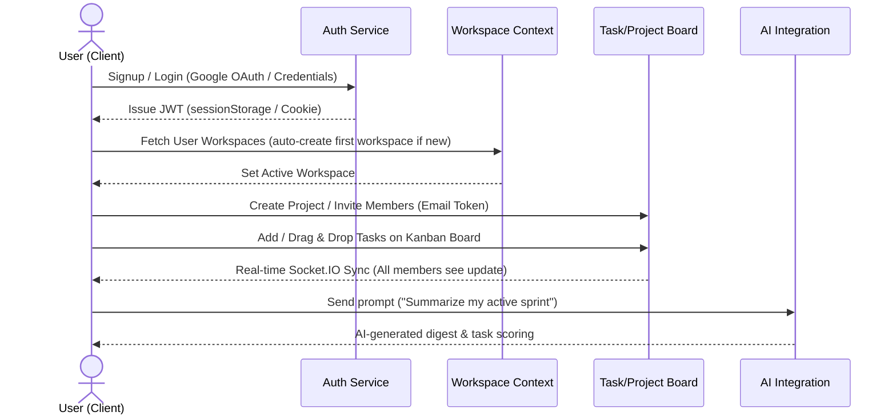

#  TaskPulse Workspace Handbook

Welcome to the **TaskPulse** project handbook. This document serves as the comprehensive guide to the architecture, purpose, workflows, and API endpoints of the TaskPulse SaaS platform.

---

##  Project Motivation & Purpose

TaskPulse was built as an **educational hobby project** designed to explore, implement, and master modern full-stack and backend engineering concepts. By choosing a SaaS (Software-as-a-Service) model, the project tackles the core challenges of building a production-ready application.

### Key Learning Objectives
*   **Authentication & Security**: Implementing robust JWT authentication, Google OAuth integrations, and secure cookie-based session management.
*   **Real-time Collaboration**: Integrating **Socket.IO** with Redis adapters to synchronize task updates across multiple clients instantaneously.
*   **Database Design**: Creating scalable, relational-like modeling in **MongoDB** using Mongoose, establishing clear associations between Workspaces, Projects, Tasks, Users, and Invites.
*   **Distributed Caching & Event Hubs**: Using **Redis** to speed up database queries, handle pub/sub events for WebSockets, and manage rate limiting.
*   **Cloud Infrastructure**: Storing user assets (avatars, task attachments) in **AWS S3** and configuring automated error tracking via **Sentry**.
*   **Email Deliverability**: Sending workspace invite emails and notifications programmatically using **Resend**.

### Real-World Viability
Although created for learning purposes, the application follows **clean architecture principles** (separation of concerns, controllers, routes, services, and middlewares). 
*   The architecture is **highly modular**, making it easy to swap databases or third-party service providers.
*   It serves as a fully functional starter kit that can be further modified, customized, and deployed to run real-world corporate task-tracking teams.
*   Anyone who is intersted can make use of the starter kit and contribute in it.

---

##  Features

- Multi-workspace collaboration
- Kanban board
- Task management
- Project management
- AI assistant
- Real-time updates
- Workspace invitations
- Google OAuth
- JWT Authentication
- AWS S3 attachments
- Analytics Dashboard
- Notifications
- Command Palette
- Dark Mode

---

##  Core Application Workflow

TaskPulse operates on a multi-tenant hierarchy: **Workspaces ➔ Projects ➔ Tasks**. Below is the step-by-step user workflow of the application:



### 1. Authentication & Onboarding
*   Users register via email/password or log in seamlessly using **Google OAuth**.
*   Upon redirect back to the client (`/auth/success`), the JWT access token is stored securely in `sessionStorage` (with backend refresh cookies).
*   If a new user does not have a workspace, the system auto-generates their first workspace.

### 2. Workspace & Collaboration
*   The dashboard allows switching between multiple workspaces.
*   Workspace admins can send invitations to new members via email. Clicking the invite link redirects users to `/invite/:token` to accept and join the team workspace.

### 3. Project & Task Board
*   Workspaces are broken down into **Projects** and **Teams**.
*   Tasks can be viewed in a traditional **List View** or a **Kanban Board** where drag-and-drop actions immediately trigger update payloads.
*   **Socket.IO** notifies other online members of status updates, comments, or task movements.

### 4. Interactive Command Palette & Global Search
*   Pressing `Ctrl + K` brings up the Command Palette allowing instant text search across all tasks, dashboard navigation, and context switching.

### 5. Analytics & Metrics
*   The analytics dashboard presents visual graphs tracking task status distribution, weekly completion rates, and team workload trends using **Recharts**.

### 6. AI Insights (The Assistant)
*   Users can open the AI Page (`/dashboard/ai`) or the floating Ask AI panel to query their workspace. The backend routes the data to **OpenRouter / Gemini** to generate weekly performance digests, prioritize backlogs, or auto-assign tasks.

---

##  Backend API Reference

The backend API is versioned under `/api/v1`. All endpoints (except public auth routes) require a bearer JWT in the `Authorization` header (`Bearer <token>`).

### 1. Authentication (`/api/v1/auth`)

| Method | Endpoint | Description | Auth Required |
| :--- | :--- | :--- | :---: |
| `POST` | `/api/v1/auth/signup` | Registers a new user account | No |
| `POST` | `/api/v1/auth/login` | Authenticates user with credentials | No |
| `GET` | `/api/v1/auth/google` | Initiates Google OAuth flow | No |
| `GET` | `/api/v1/auth/me` | Gets details of current logged-in user | Yes |
| `POST` | `/api/v1/auth/logout` | Revokes sessions and clears auth cookies | Yes |

### 2. Workspaces (`/api/v1/workspaces`)

| Method | Endpoint | Description | Auth Required |
| :--- | :--- | :--- | :---: |
| `GET` | `/api/v1/workspaces` | Lists all workspaces the user belongs to | Yes |
| `POST` | `/api/v1/workspaces` | Creates a new workspace | Yes |
| `PATCH` | `/api/v1/workspaces/:id` | Updates workspace metadata (name, slug) | Yes |
| `DELETE` | `/api/v1/workspaces/:id` | Deletes a workspace (Admins only) | Yes |

### 3. Projects (`/api/v1/projects`)

| Method | Endpoint | Description | Auth Required |
| :--- | :--- | :--- | :---: |
| `GET` | `/api/v1/projects` | Gets all projects in the active workspace | Yes |
| `POST` | `/api/v1/projects` | Creates a new project in the workspace | Yes |
| `PATCH` | `/api/v1/projects/:id` | Modifies project details, progress, or status | Yes |
| `DELETE` | `/api/v1/projects/:id` | Deletes a project | Yes |

### 4. Tasks (`/api/v1/tasks`)

| Method | Endpoint | Description | Auth Required |
| :--- | :--- | :--- | :---: |
| `GET` | `/api/v1/tasks` | Gets tasks (filters by workspaceId, projectId, or assignee) | Yes |
| `POST` | `/api/v1/tasks` | Creates a new task | Yes |
| `PATCH` | `/api/v1/tasks/:id` | Updates a task (status, columns, score, description) | Yes |
| `DELETE` | `/api/v1/tasks/:id` | Deletes a task | Yes |

### 5. Collaboration & Invites (`/api/v1/invites`)

| Method | Endpoint | Description | Auth Required |
| :--- | :--- | :--- | :---: |
| `POST` | `/api/v1/invites` | Creates a new member invitation and emails the token | Yes |
| `GET` | `/api/v1/invites/verify/:token` | Validates invite token without logging in | No |
| `POST` | `/api/v1/invites/accept` | Accepts invitation and adds user to the workspace | Yes |

### 6. AI Features (`/api/v1/ai`)

| Method | Endpoint | Description | Auth Required |
| :--- | :--- | :--- | :---: |
| `POST` | `/api/v1/ai/chat` | Sends workspace context to AI for natural language queries | Yes |
| `POST` | `/api/v1/ai/prioritize` | Requests AI task scoring based on descriptions and due dates | Yes |

### 7. Analytics (`/api/v1/analytics`)

| Method | Endpoint | Description | Auth Required |
| :--- | :--- | :--- | :---: |
| `GET` | `/api/v1/analytics/overview` | Retrieves workspace task metrics (totals, status ratios) | Yes |
| `GET` | `/api/v1/analytics/performance` | Gets team member completion velocity charts | Yes |

### 8. Notifications & Layout Views (`/api/v1/notifications` & `/api/v1/views`)

| Method | Endpoint | Description | Auth Required |
| :--- | :--- | :--- | :---: |
| `GET` | `/api/v1/notifications` | Fetches system notifications for the current user | Yes |
| `PATCH` | `/api/v1/notifications/:id/read` | Marks a specific notification as read | Yes |
| `POST` | `/api/v1/views` | Saves custom filter presets (e.g. "My High Priority Issues") | Yes |

---

##  Frontend Tech Stack

The user interface in `sample/sample-design` is crafted with a modern, high-performance web development stack:

*   **React 19 & Vite 8**: Standard-setting framework and build engine utilizing the **React Compiler** for automatic component re-render optimizations.
*   **Tailwind CSS & CSS Variables**: A robust styling system integrating flexible layout overrides with support for system-wide light/dark themes.
*   **Framer Motion**: Powering sleek micro-animations (slide-ins, dropdown transitions, and hover offsets) for an interactive dashboard experience.
*   **Drag and Drop (`@hello-pangea/dnd`)**: Controls the fluid movement of cards between columns on the Kanban board.
*   **Socket.IO Client**: Integrates real-time messaging protocols to listen for changes from the server database.

---

##  Local Development Setup

To run the frontend and connect it to the server:

1.  **Navigate to the design folder**:
    ```bash
    cd sample/sample-design
    ```
2.  **Install dependencies**:
    ```bash
    npm install
    ```
3.  **Configure environment variables**:
    Create a `.env` file in `sample/sample-design` and define:
    ```env
    VITE_API_URL="http://localhost:3000/api/v1"
    ```
4.  **Run in development mode**:
    ```bash
    npm run dev
    ```
5.  **Build production bundle**:
    ```bash
    npm run build
    ```

---

##  Screenshots

Here is a visual overview of the TaskPulse platform, showing the system architecture, landing interface, authentication flows, and interactive dashboard sections. 

### 1. Backend Architecture

*High-level architecture view showcasing the connection between our React client, Express API, Redis caching, Mongo Database, and external microservices.*

### 2. Landing Page

*The dark-mode styled public landing page featuring call-to-actions, feature lists, and dynamic UI elements.*

### 3.  Authentication Page

*Clean, minimalistic authentication interface providing credentials login and secure Google OAuth integration.*

### 4.  Dashboard (Command Center)

*The primary workspace view displaying user tasks, team activity feeds, and active workspace filters.*

### 5.  Analytics Dashboard

*Data visualization dashboard displaying task progress distribution, weekly team completion velocity, and project status details.*

### 6.  Task Board (Kanban View)

*The drag-and-drop enabled project kanban board, separating tasks into Backlog, Todo, In Progress, Review, and Done lanes.*

